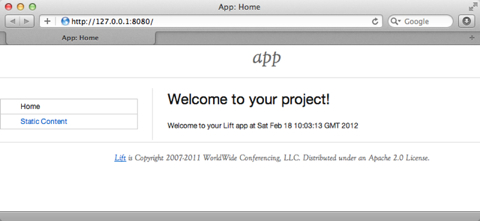

Downloading and running Lift 
=============================

Problem
-------

You want to install and run Lift on your computer.

Solution
---------

The only prerequisite for installing and running Lift is to have Java 1.5 or later installed.  Instructions for installing Java can be found at [java.com](http://java.com/en/download/manual.jsp).

Once you have Java, the following instructions will download, build and start a basic Lift application.

### for Mac and Linux ###

* Download: [https://github.com/d6y/lift_24_sbt/zipball/master](https://github.com/d6y/lift_24_sbt/zipball/master)
* Unzip the file
* Start Terminal or your favourite shell tool
* Navigate into the unzipped folder
* Run:`./sbt` 
* Required libraries will be downloaded
* At the SBT prompt (>) type: `container:start`
* Start your browser and go to `http://127.0.0.1:8080/`

### for Windows ###

* Download: [https://github.com/d6y/lift_24_sbt/zipball/master](https://github.com/d6y/lift_24_sbt/zipball/master)
* Unzip the file
* ?
* Run:`./sbt.bat` 
* Required libraries will be downloaded
* At the SBT prompt (>) type: `container:start`
* Start your browser and go to `http://127.0.0.1:8080/`

### Expected result ###

The result of the above commands should be a basic Lift app running on your computer.

Discussion
----------

Lift isn't installed in the usual sense of "installing software".  Instead it uses standard build tools, such as SBT or Maven, to assemble your application built with the Lift framework. This recipe has downloaded a bare-bones Lift application, and then started it using a build tool.

The `sbt` command starts the Simple Build Tool, a dependency management tool used by Scala projects.  It will check the project and download any libraries required by this Lift application.  The command `container:start` starts the web server on port 8080 (by default) and passes requests to the Lift application.

You may be wondering why this recipe doesn't use the official Lift [getting started page](http://liftweb.net/getting_started) download.  It's because that download currently uses an older version of SBT which has a different structure and different commands compared to the latest version we use in this cookbook.

See also
--------

* [Simple Build Tool](https://github.com/harrah/xsbt/wiki)

